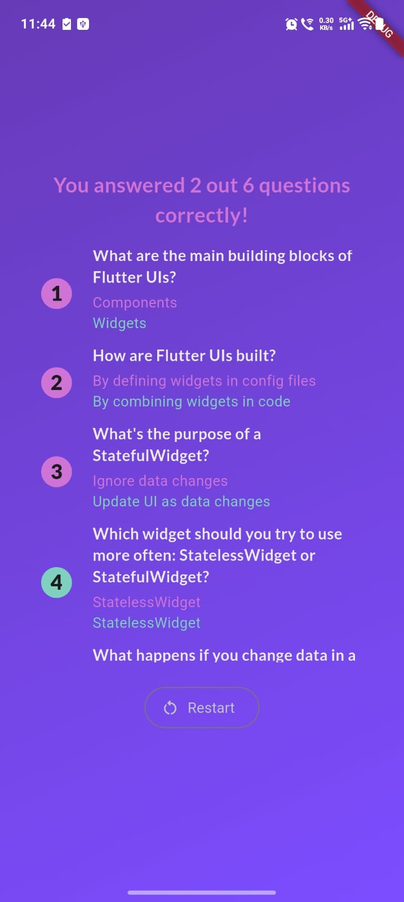
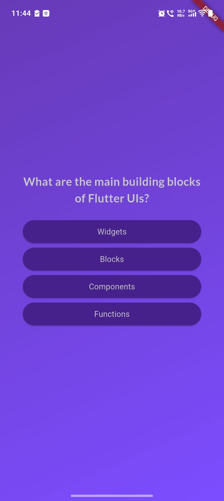
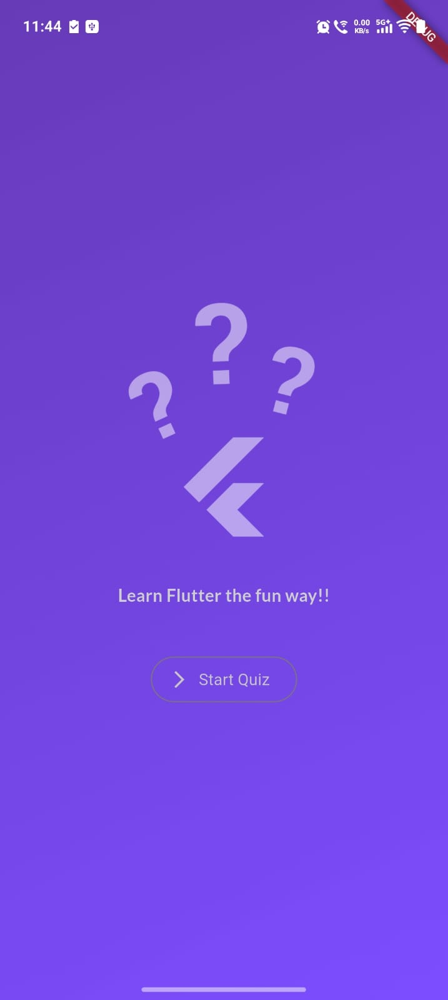

# quizz-app
This project was created while following a Flutter & Dart course from udemy.
# Flutter Quiz App

## Features

- Multiple-choice questions
- Answer tracking
- Results screen
- Restart quiz functionality
- Custom UI styling

## Concepts Used

- StatefulWidget
- StatelessWidget
- Callback Functions
- Lists & Maps
- Row & Column
- SingleChildScrollView
- Dynamic Widget Generation using map()

## Built With

- Flutter
- Dart

 ## Screenshots

  
  
  

